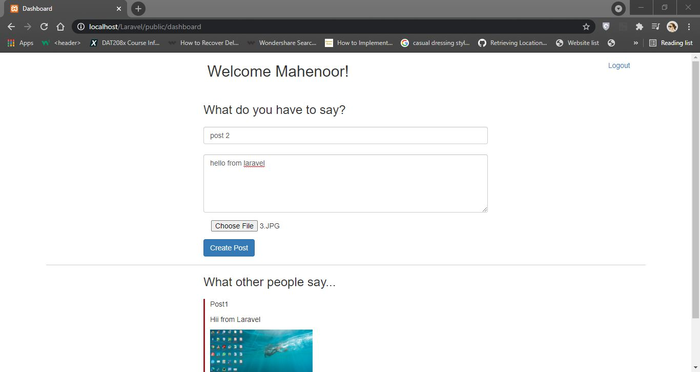

# Laravel-Social-Media
A Laravel project where a user can: 
1. Create an account with following details: email, password, first_name, last_name 
2. Login using the given email and password.
3. Create a post with following details: title, description, image(jpeg/png).
4. See a list of all posts created.

# Also implemented :
User can :

5.Log out User.

6.Delete Posts.

# Signup and Sign in

# Dashboard

# View Posts

# Delete Posts

